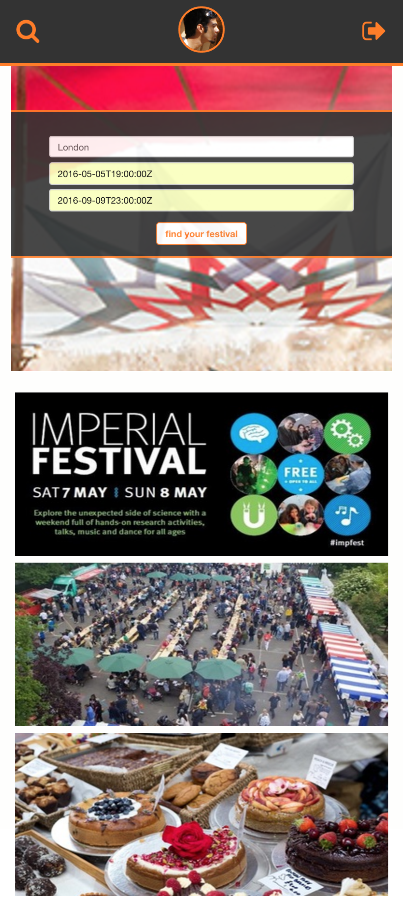

# WDI Project 4 - Find-A-Fest

>#### Find-A-Fest is a full stack MEAN app to select festivals near you and return weather and map data. It was developed as an Angular single page application and was developed in five days.

###How it Works:
	
users log in via Eventbrite or Github oAuth and are able to select a location and date. The app will then return relevant festivals as well as map and weather information

###To install locally:
	
Clone this repo to your local machine, then `cd` into the root directory of the repo and `npm install`
		 
###Technologies Used:

* MEAN Stack (MongoDB, Express, AngularJS and Node.js)
* oAuth (Eventbrite and Github)
* MVW design pattern with RESTful routes
* Multiple APIs used (Eventbrite, Google Maps, OpenWeather)
* JSON Web Tokens
* Bower Components
* SASS for CSS compilation
* Bootstrap CSS Framework

###Improvements to be made:

  * Current design is only for mobile displays. Design for larger displays is required.
  * The weather doesn't properly work
  * Add further functionality using Eventbrite's API so that a user can select a festival to attend which will then update their Eventbrite account too.
